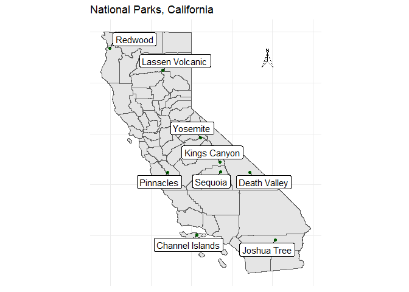

## Overview
This week's data is from dataisplural/data.world.

There are some additional datasets that may be interesting in relation to this data - namely US population and gas prices over time.

There's also some shapefiles you might be able to use with the sf package.

## Load data

```r
library(tidyverse)
library(sf)
library(ggrepel)
library(ggsn)

#Import data
park_visits <- readr::read_csv("https://raw.githubusercontent.com/rfordatascience/tidytuesday/master/data/2019/2019-09-17/national_parks.csv")
state_pop <- readr::read_csv("https://raw.githubusercontent.com/rfordatascience/tidytuesday/master/data/2019/2019-09-17/state_pop.csv")
gas_price <- readr::read_csv("https://raw.githubusercontent.com/rfordatascience/tidytuesday/master/data/2019/2019-09-17/gas_price.csv")
head(park_visits)
```


year   gnis_id   geometry       metadata    number_of_records  parkname                 region   state   unit_code   unit_name                                         unit_type                   visitors
-----  --------  -------------  ---------  ------------------  -----------------------  -------  ------  ----------  ------------------------------------------------  -------------------------  ---------
1904   1163670   POLYGON        NA                          1  Crater Lake              PW       OR      CRLA        Crater Lake National Park                         National Park                   1500
1941   1531834   MULTIPOLYGON   NA                          1  Lake Roosevelt           PW       WA      LARO        Lake Roosevelt National Recreation Area           National Recreation Area           0
1961   2055170   MULTIPOLYGON   NA                          1  Lewis and Clark          PW       WA      LEWI        Lewis and Clark National Historical Park          National Historical Park       69000
1935   1530459   MULTIPOLYGON   NA                          1  Olympic                  PW       WA      OLYM        Olympic National Park                             National Park                   2200
1982   277263    POLYGON        NA                          1  Santa Monica Mountains   PW       CA      SAMO        Santa Monica Mountains National Recreation Area   National Recreation Area      468144
1919   578853    MULTIPOLYGON   NA                          1  NA                       NE       ME      ACAD        Acadia National Park                              National Park                  64000

```r
#National Park centroids
park_cent <- read_sf(dsn = here::here("nps_boundary_centroids", "nps_boundary_centroids.shp"), layer = "nps_boundary_centroids")
#California counties
ca_count <- read_sf(dsn = here::here("CA_Counties", "CA_counties_TIGER2016.shp"), layer = "CA_counties_TIGER2016")
```

## Analysis/visualization


```r
park_ca <- park_cent %>% filter(STATE == "CA" & UNIT_TYPE == "National Park")
park_ca %>% ggplot() + geom_sf(data=ca_count) +
  geom_sf(data = park_ca, color = "dark green") + theme_minimal() +
  ggrepel::geom_label_repel(
    data = park_ca,
    aes(label = PARKNAME, geometry = geometry),
    stat = "sf_coordinates",
    min.segment.length = 0
  ) + labs(title = "National Parks, California", x = NULL, y = NULL) + north(park_ca, location = "topright", symbol = 3) + theme(axis.text = element_blank(),
                       axis.title = element_blank(),
                       axis.ticks = element_blank())
```

```
## Warning in st_point_on_surface.sfc(sf::st_zm(x)): st_point_on_surface may
## not give correct results for longitude/latitude data
```

<!-- -->

## Results


## Discussion/conclusions

## Package citations
  Hadley Wickham (2017). tidyverse: Easily Install and Load the
  'Tidyverse'. R package version 1.2.1.
  https://CRAN.R-project.org/package=tidyverse
  
  Pebesma, E., 2018. Simple Features for R: Standardized Support for
  Spatial Vector Data. The R Journal 10 (1), 439-446,
  https://doi.org/10.32614/RJ-2018-009
  
  Kamil Slowikowski (2019). ggrepel: Automatically Position Non-Overlapping
  Text Labels with 'ggplot2'. R package version 0.8.1.
  https://CRAN.R-project.org/package=ggrepel
  
  Oswaldo Santos Baquero (2019). ggsn: North Symbols and Scale Bars for
  Maps Created with 'ggplot2' or 'ggmap'. R package version 0.5.0.
  https://CRAN.R-project.org/package=ggsn
  


