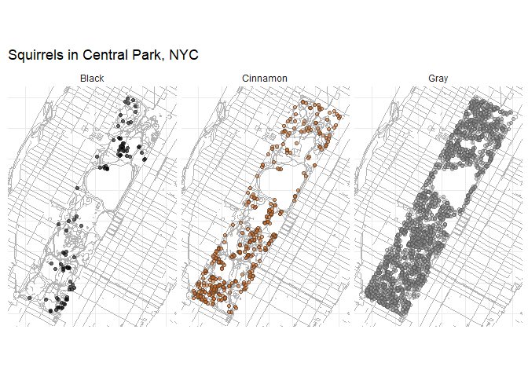
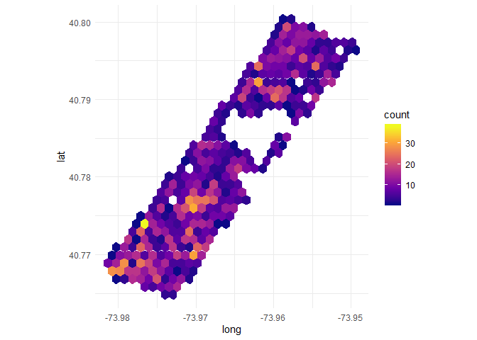
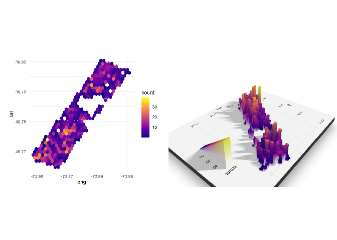

## Overview
This week's data is from the NYC Squirrel Census - raw data at [NY Data](# https://data.cityofnewyork.us/Environment/2018-Central-Park-Squirrel-Census-Squirrel-Data/vfnx-vebw).

## Load data

```r
library(tidyverse)
library(sf)
library(ggsn) #Can be used to add scale bars and north arrow to maps
#Import shapefile of Central Park
cp <- sf::read_sf(dsn = here::here("CentralAndProspectParks", "CentralPark.shp"), layer = "CentralPark")
pp <- sf::read_sf(dsn = here::here("CentralAndProspectParks", "ProspectPark.shp"), layer = "ProspectPark")

squirrels <- read_csv("squirrels.csv")
head(squirrels)
```


 X1        long        lat  unique_squirrel_id   hectare   shift        date   hectare_squirrel_number  age        primary_fur_color   highlight_fur_color   combination_of_primary_and_highlight_color   color_notes   location       above_ground_sighter_measurement   specific_location   running   chasing   climbing   eating   foraging   other_activities        kuks    quaas   moans   tail_flags   tail_twitches   approaches   indifferent   runs_from   other_interactions   lat_long                                        zip_codes   community_districts   borough_boundaries   city_council_districts   police_precincts
---  ----------  ---------  -------------------  --------  ------  ---------  ------------------------  ---------  ------------------  --------------------  -------------------------------------------  ------------  -------------  ---------------------------------  ------------------  --------  --------  ---------  -------  ---------  ----------------------  ------  ------  ------  -----------  --------------  -----------  ------------  ----------  -------------------  ---------------------------------------------  ----------  --------------------  -------------------  -----------------------  -----------------
  1   -73.95613   40.79408  37F-PM-1014-03       37F       PM       10142018                         3  NA         NA                  NA                    +                                            NA            NA             NA                                 NA                  FALSE     FALSE     FALSE      FALSE    FALSE      NA                      FALSE   FALSE   FALSE   FALSE        FALSE           FALSE        FALSE         FALSE       NA                   POINT (-73.9561344937861 40.7940823884086)             NA                    19                    4                       19                 13
  2   -73.95704   40.79485  37E-PM-1006-03       37E       PM       10062018                         3  Adult      Gray                Cinnamon              Gray+Cinnamon                                NA            Ground Plane   FALSE                              NA                  TRUE      FALSE     FALSE      FALSE    FALSE      NA                      FALSE   FALSE   FALSE   FALSE        FALSE           FALSE        FALSE         TRUE        me                   POINT (-73.9570437717691 40.794850940803904)           NA                    19                    4                       19                 13
  3   -73.97683   40.76672  2E-AM-1010-03        02E       AM       10102018                         3  Adult      Cinnamon            NA                    Cinnamon+                                    NA            Above Ground   4                                  NA                  FALSE     FALSE     TRUE       FALSE    FALSE      NA                      FALSE   FALSE   FALSE   FALSE        FALSE           FALSE        TRUE          FALSE       NA                   POINT (-73.9768311751004 40.76671780725581)            NA                    19                    4                       19                 13
  4   -73.97572   40.76970  5D-PM-1018-05        05D       PM       10182018                         5  Juvenile   Gray                NA                    Gray+                                        NA            Above Ground   3                                  NA                  FALSE     FALSE     TRUE       FALSE    FALSE      NA                      FALSE   FALSE   FALSE   FALSE        FALSE           FALSE        FALSE         TRUE        NA                   POINT (-73.9757249834141 40.7697032606755)             NA                    19                    4                       19                 13
  5   -73.95931   40.79753  39B-AM-1018-01       39B       AM       10182018                         1  NA         NA                  NA                    +                                            NA            Above Ground   NA                                 NA                  FALSE     FALSE     FALSE      FALSE    FALSE      unknown                 TRUE    FALSE   FALSE   FALSE        FALSE           FALSE        FALSE         FALSE       NA                   POINT (-73.9593126695714 40.797533370163)              NA                    19                    4                       19                 13
  6   -73.95657   40.79026  33H-AM-1019-02       33H       AM       10192018                         2  Juvenile   Gray                Cinnamon              Gray+Cinnamon                                NA            Ground Plane   FALSE                              NA                  FALSE     FALSE     FALSE      FALSE    FALSE      wrestling with mother   FALSE   FALSE   FALSE   FALSE        FALSE           FALSE        FALSE         FALSE       NA                   POINT (-73.9565700386162 40.7902561000937)             NA                    19                    4                       19                 13

## Analysis/visualization


```r
cols <- c("black", "brown", "grey55")
squirrels %>% filter(!is.na(primary_fur_color)) %>% 
  ggplot() +
  geom_sf(data = cp, color = "grey70") +
  geom_point(
    aes(long, lat,
        fill = primary_fur_color,
        alpha = primary_fur_color),
    shape = 21,
    color = "grey20",
    size = 1.5,
    stroke = 0.2
  ) +
  scale_x_continuous(limits = c(-73.982,-73.9495)) +
  scale_y_continuous(limits = c(40.7648, 40.8)) +
  scale_fill_manual(values = c("black", "#d2691e", "grey60"),
                    guide = F) +
  scale_alpha_manual(values = c(0.6, 0.6, 0.4),
                     guide = F) + theme_minimal() + facet_grid( ~ primary_fur_color) +
  labs(x = NULL, y = NULL, title = "Squirrels in Central Park, NYC") + theme(axis.text = element_blank(),
                       axis.title = element_blank(),
                       axis.ticks = element_blank())
```

```
## Warning: Removed 2 rows containing missing values (geom_point).
```

<!-- -->


```r
sq <- ggplot(squirrels, aes(long, lat)) + geom_hex() + coord_fixed() + 
  theme_minimal() +
  scale_fill_viridis_c(option = "C")
sq
```

<!-- -->

```r
#3D version
library(rayshader)
par(mfrow = c(1, 2))
plot_gg(sq, width = 5, height = 4, scale = 300, raytrace = FALSE, preview = TRUE)
plot_gg(sq, width = 5, height = 4, scale = 300, multicore = TRUE, windowsize = c(1000, 800))
render_camera(fov = 70, zoom = 0.5, theta = 130, phi = 35)
Sys.sleep(0.2)
render_snapshot()
```

<!-- -->

## Results
+ Squirrels are more often observed in the southern end of Central Park
+ Grey squirrels are the most common in Central Park
+ A hexagonal density map can be a useful way of visualising density patterns

## Discussion/conclusions

## Package citations
  Hadley Wickham (2017). tidyverse: Easily Install and Load the
  'Tidyverse'. R package version 1.2.1.
  https://CRAN.R-project.org/package=tidyverse
  
  Yihui Xie (2019). knitr: A General-Purpose Package for Dynamic Report
  Generation in R. R package version 1.25.
  
  Yihui Xie (2017). printr: Automatically Print R Objects to Appropriate
  Formats According to the 'knitr' Output Format. R package version 0.1.
  https://CRAN.R-project.org/package=printr
  
  Tyler Morgan-Wall (2019). rayshader: Create and Visualize Hillshaded Maps
  from Elevation Matrices. R package version 0.11.5.
  https://CRAN.R-project.org/package=rayshader


