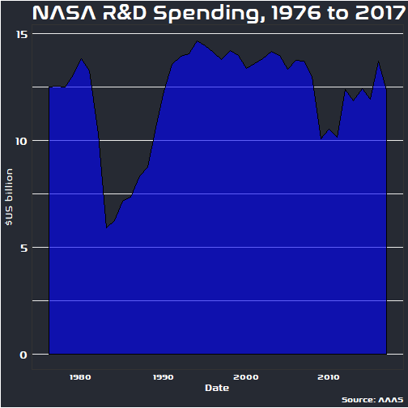
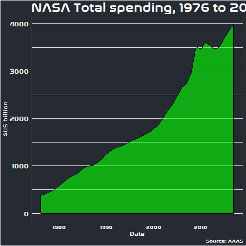

```r
library(tidyverse)
options(scipen=999)
#Import data
fed_rd <- read_csv("fed_rd.csv")
```

```
## Parsed with column specification:
## cols(
##   department = col_character(),
##   year = col_integer(),
##   rd_budget = col_double(),
##   total_outlays = col_double(),
##   discretionary_outlays = col_double(),
##   gdp = col_double()
## )
```

```r
#Set theme using NASA font -> use loadfonts
extrafont::loadfonts(device="win")
```

```
## AGA Arabesque already registered with windowsFonts().
```

```
## AGA Arabesque Desktop already registered with windowsFonts().
```

```
## Agency FB already registered with windowsFonts().
```

```
## Akhbar MT already registered with windowsFonts().
```

```
## Algerian already registered with windowsFonts().
```

```
## Arial Black already registered with windowsFonts().
```

```
## Arial already registered with windowsFonts().
```

```
## Arial Narrow already registered with windowsFonts().
```

```
## Arial Rounded MT Bold already registered with windowsFonts().
```

```
## Arial Unicode MS already registered with windowsFonts().
```

```
## Baskerville Old Face already registered with windowsFonts().
```

```
## Bauhaus 93 already registered with windowsFonts().
```

```
## Bell MT already registered with windowsFonts().
```

```
## Berlin Sans FB already registered with windowsFonts().
```

```
## Berlin Sans FB Demi already registered with windowsFonts().
```

```
## Bernard MT Condensed already registered with windowsFonts().
```

```
## Blackadder ITC already registered with windowsFonts().
```

```
## Bodoni MT already registered with windowsFonts().
```

```
## Bodoni MT Black already registered with windowsFonts().
```

```
## Bodoni MT Condensed already registered with windowsFonts().
```

```
## Bodoni MT Poster Compressed already registered with windowsFonts().
```

```
## Bold Italic Art already registered with windowsFonts().
```

```
## Book Antiqua already registered with windowsFonts().
```

```
## Bookman Old Style already registered with windowsFonts().
```

```
## Bookshelf Symbol 7 already registered with windowsFonts().
```

```
## Bradley Hand ITC already registered with windowsFonts().
```

```
## Britannic Bold already registered with windowsFonts().
```

```
## Broadway already registered with windowsFonts().
```

```
## Brush Script MT already registered with windowsFonts().
```

```
## Calibri already registered with windowsFonts().
```

```
## Calibri Light already registered with windowsFonts().
```

```
## Californian FB already registered with windowsFonts().
```

```
## Calisto MT already registered with windowsFonts().
```

```
## Cambria already registered with windowsFonts().
```

```
## Candara already registered with windowsFonts().
```

```
## Castellar already registered with windowsFonts().
```

```
## Centaur already registered with windowsFonts().
```

```
## Century already registered with windowsFonts().
```

```
## Century Gothic already registered with windowsFonts().
```

```
## Century Schoolbook already registered with windowsFonts().
```

```
## Chiller already registered with windowsFonts().
```

```
## Colonna MT already registered with windowsFonts().
```

```
## Comic Sans MS already registered with windowsFonts().
```

```
## Consolas already registered with windowsFonts().
```

```
## Constantia already registered with windowsFonts().
```

```
## Cooper Black already registered with windowsFonts().
```

```
## Copperplate Gothic Bold already registered with windowsFonts().
```

```
## Copperplate Gothic Light already registered with windowsFonts().
```

```
## Corbel already registered with windowsFonts().
```

```
## Courier New already registered with windowsFonts().
```

```
## Curlz MT already registered with windowsFonts().
```

```
## DecoType Naskh already registered with windowsFonts().
```

```
## DecoType Naskh Extensions already registered with windowsFonts().
```

```
## DecoType Naskh Special already registered with windowsFonts().
```

```
## DecoType Naskh Swashes already registered with windowsFonts().
```

```
## DecoType Naskh Variants already registered with windowsFonts().
```

```
## DecoType Thuluth already registered with windowsFonts().
```

```
## Diwani Bent already registered with windowsFonts().
```

```
## Diwani Letter already registered with windowsFonts().
```

```
## Diwani Outline Shaded already registered with windowsFonts().
```

```
## Diwani Simple Outline already registered with windowsFonts().
```

```
## Diwani Simple Outline 2 already registered with windowsFonts().
```

```
## Diwani Simple Striped already registered with windowsFonts().
```

```
## Ebrima already registered with windowsFonts().
```

```
## Edwardian Script ITC already registered with windowsFonts().
```

```
## Elephant already registered with windowsFonts().
```

```
## Engravers MT already registered with windowsFonts().
```

```
## Eras Bold ITC already registered with windowsFonts().
```

```
## Eras Demi ITC already registered with windowsFonts().
```

```
## Eras Light ITC already registered with windowsFonts().
```

```
## Eras Medium ITC already registered with windowsFonts().
```

```
## Farsi Simple Bold already registered with windowsFonts().
```

```
## Farsi Simple Outline already registered with windowsFonts().
```

```
## Felix Titling already registered with windowsFonts().
```

```
## Footlight MT Light already registered with windowsFonts().
```

```
## Forte already registered with windowsFonts().
```

```
## Franklin Gothic Book already registered with windowsFonts().
```

```
## Franklin Gothic Demi already registered with windowsFonts().
```

```
## Franklin Gothic Demi Cond already registered with windowsFonts().
```

```
## Franklin Gothic Heavy already registered with windowsFonts().
```

```
## Franklin Gothic Medium already registered with windowsFonts().
```

```
## Franklin Gothic Medium Cond already registered with windowsFonts().
```

```
## Freestyle Script already registered with windowsFonts().
```

```
## French Script MT already registered with windowsFonts().
```

```
## FZShuTi already registered with windowsFonts().
```

```
## FZYaoTi already registered with windowsFonts().
```

```
## Gabriola already registered with windowsFonts().
```

```
## Gadugi already registered with windowsFonts().
```

```
## Garamond already registered with windowsFonts().
```

```
## Georgia already registered with windowsFonts().
```

```
## Gigi already registered with windowsFonts().
```

```
## Gill Sans Ultra Bold already registered with windowsFonts().
```

```
## Gill Sans Ultra Bold Condensed already registered with windowsFonts().
```

```
## Gill Sans MT already registered with windowsFonts().
```

```
## Gill Sans MT Condensed already registered with windowsFonts().
```

```
## Gill Sans MT Ext Condensed Bold already registered with windowsFonts().
```

```
## Gloucester MT Extra Condensed already registered with windowsFonts().
```

```
## Goudy Old Style already registered with windowsFonts().
```

```
## Goudy Stout already registered with windowsFonts().
```

```
## Haettenschweiler already registered with windowsFonts().
```

```
## Harlow Solid Italic already registered with windowsFonts().
```

```
## Harrington already registered with windowsFonts().
```

```
## High Tower Text already registered with windowsFonts().
```

```
## Impact already registered with windowsFonts().
```

```
## Imprint MT Shadow already registered with windowsFonts().
```

```
## Informal Roman already registered with windowsFonts().
```

```
## Italic Outline Art already registered with windowsFonts().
```

```
## Javanese Text already registered with windowsFonts().
```

```
## Jokerman already registered with windowsFonts().
```

```
## Juice ITC already registered with windowsFonts().
```

```
## Kristen ITC already registered with windowsFonts().
```

```
## Kufi Extended Outline already registered with windowsFonts().
```

```
## Kufi Outline Shaded already registered with windowsFonts().
```

```
## Kunstler Script already registered with windowsFonts().
```

```
## Wide Latin already registered with windowsFonts().
```

```
## Led Italic Font already registered with windowsFonts().
```

```
## Leelawadee already registered with windowsFonts().
```

```
## Leelawadee UI already registered with windowsFonts().
```

```
## Leelawadee UI Semilight already registered with windowsFonts().
```

```
## LiSu already registered with windowsFonts().
```

```
## Lucida Bright already registered with windowsFonts().
```

```
## Lucida Calligraphy already registered with windowsFonts().
```

```
## Lucida Console already registered with windowsFonts().
```

```
## Lucida Fax already registered with windowsFonts().
```

```
## Lucida Handwriting already registered with windowsFonts().
```

```
## Lucida Sans already registered with windowsFonts().
```

```
## Lucida Sans Typewriter already registered with windowsFonts().
```

```
## Lucida Sans Unicode already registered with windowsFonts().
```

```
## Magneto already registered with windowsFonts().
```

```
## Maiandra GD already registered with windowsFonts().
```

```
## Malgun Gothic already registered with windowsFonts().
```

```
## Malgun Gothic Semilight already registered with windowsFonts().
```

```
## Marlett already registered with windowsFonts().
```

```
## Matura MT Script Capitals already registered with windowsFonts().
```

```
## Microsoft Himalaya already registered with windowsFonts().
```

```
## Microsoft Yi Baiti already registered with windowsFonts().
```

```
## Microsoft New Tai Lue already registered with windowsFonts().
```

```
## Microsoft PhagsPa already registered with windowsFonts().
```

```
## Microsoft Sans Serif already registered with windowsFonts().
```

```
## Microsoft Tai Le already registered with windowsFonts().
```

```
## Mistral already registered with windowsFonts().
```

```
## Modern No. 20 already registered with windowsFonts().
```

```
## Mongolian Baiti already registered with windowsFonts().
```

```
## Monotype Corsiva already registered with windowsFonts().
```

```
## Monotype Koufi already registered with windowsFonts().
```

```
## MS Outlook already registered with windowsFonts().
```

```
## MS Reference Sans Serif already registered with windowsFonts().
```

```
## MS Reference Specialty already registered with windowsFonts().
```

```
## MT Extra already registered with windowsFonts().
```

```
## Mudir MT already registered with windowsFonts().
```

```
## MV Boli already registered with windowsFonts().
```

```
## Myanmar Text already registered with windowsFonts().
```

```
## Niagara Engraved already registered with windowsFonts().
```

```
## Niagara Solid already registered with windowsFonts().
```

```
## Nirmala UI already registered with windowsFonts().
```

```
## Nirmala UI Semilight already registered with windowsFonts().
```

```
## OCR A Extended already registered with windowsFonts().
```

```
## Old Antic Bold already registered with windowsFonts().
```

```
## Old Antic Decorative already registered with windowsFonts().
```

```
## Old Antic Outline already registered with windowsFonts().
```

```
## Old Antic Outline Shaded already registered with windowsFonts().
```

```
## Old English Text MT already registered with windowsFonts().
```

```
## Onyx already registered with windowsFonts().
```

```
## Palace Script MT already registered with windowsFonts().
```

```
## Palatino Linotype already registered with windowsFonts().
```

```
## Papyrus already registered with windowsFonts().
```

```
## Parchment already registered with windowsFonts().
```

```
## Perpetua already registered with windowsFonts().
```

```
## Perpetua Titling MT already registered with windowsFonts().
```

```
## Playbill already registered with windowsFonts().
```

```
## Poor Richard already registered with windowsFonts().
```

```
## Pristina already registered with windowsFonts().
```

```
## PT Bold Arch already registered with windowsFonts().
```

```
## PT Bold Broken already registered with windowsFonts().
```

```
## PT Bold Dusky already registered with windowsFonts().
```

```
## PT Bold Heading already registered with windowsFonts().
```

```
## PT Bold Mirror already registered with windowsFonts().
```

```
## PT Bold Stars already registered with windowsFonts().
```

```
## PT Separated Baloon already registered with windowsFonts().
```

```
## PT Simple Bold Ruled already registered with windowsFonts().
```

```
## Rage Italic already registered with windowsFonts().
```

```
## Ravie already registered with windowsFonts().
```

```
## Rockwell already registered with windowsFonts().
```

```
## Rockwell Condensed already registered with windowsFonts().
```

```
## Rockwell Extra Bold already registered with windowsFonts().
```

```
## Script MT Bold already registered with windowsFonts().
```

```
## Segoe MDL2 Assets already registered with windowsFonts().
```

```
## Segoe Print already registered with windowsFonts().
```

```
## Segoe Script already registered with windowsFonts().
```

```
## Segoe UI already registered with windowsFonts().
```

```
## Segoe UI Light already registered with windowsFonts().
```

```
## Segoe UI Semibold already registered with windowsFonts().
```

```
## Segoe UI Semilight already registered with windowsFonts().
```

```
## Segoe UI Black already registered with windowsFonts().
```

```
## Segoe UI Historic already registered with windowsFonts().
```

```
## Segoe UI Symbol already registered with windowsFonts().
```

```
## Showcard Gothic already registered with windowsFonts().
```

```
## Simple Bold Jut Out already registered with windowsFonts().
```

```
## Simple Indust Outline already registered with windowsFonts().
```

```
## Simple Indust Shaded already registered with windowsFonts().
```

```
## Simple Outline Pat already registered with windowsFonts().
```

```
## SimSun-ExtB already registered with windowsFonts().
```

```
## Snap ITC already registered with windowsFonts().
```

```
## STCaiyun already registered with windowsFonts().
```

```
## Stencil already registered with windowsFonts().
```

```
## STFangsong already registered with windowsFonts().
```

```
## STHupo already registered with windowsFonts().
```

```
## STKaiti already registered with windowsFonts().
```

```
## STLiti already registered with windowsFonts().
```

```
## STSong already registered with windowsFonts().
```

```
## STXihei already registered with windowsFonts().
```

```
## STXingkai already registered with windowsFonts().
```

```
## STXinwei already registered with windowsFonts().
```

```
## STZhongsong already registered with windowsFonts().
```

```
## Sylfaen already registered with windowsFonts().
```

```
## Symbol already registered with windowsFonts().
```

```
## Tahoma already registered with windowsFonts().
```

```
## Tempus Sans ITC already registered with windowsFonts().
```

```
## Times New Roman already registered with windowsFonts().
```

```
## Trebuchet MS already registered with windowsFonts().
```

```
## Tw Cen MT already registered with windowsFonts().
```

```
## Tw Cen MT Condensed already registered with windowsFonts().
```

```
## Tw Cen MT Condensed Extra Bold already registered with windowsFonts().
```

```
## Verdana already registered with windowsFonts().
```

```
## Viner Hand ITC already registered with windowsFonts().
```

```
## Vivaldi already registered with windowsFonts().
```

```
## Vladimir Script already registered with windowsFonts().
```

```
## Webdings already registered with windowsFonts().
```

```
## Wingdings already registered with windowsFonts().
```

```
## Wingdings 2 already registered with windowsFonts().
```

```
## Wingdings 3 already registered with windowsFonts().
```

```
## YouYuan already registered with windowsFonts().
```

```
## FontAwesome already registered with windowsFonts().
```

```
## Bahnschrift already registered with windowsFonts().
```

```
## Fira Code already registered with windowsFonts().
```

```
## Fira Code Light already registered with windowsFonts().
```

```
## Fira Code Medium already registered with windowsFonts().
```

```
## Fira Code Retina already registered with windowsFonts().
```

```
## HoloLens MDL2 Assets already registered with windowsFonts().
```

```
## Homemade Apple already registered with windowsFonts().
```

```
## IBM Plex Sans already registered with windowsFonts().
```

```
## IBM Plex Sans ExtraLight already registered with windowsFonts().
```

```
## IBM Plex Sans Light already registered with windowsFonts().
```

```
## IBM Plex Sans Medium already registered with windowsFonts().
```

```
## IBM Plex Sans SemiBold already registered with windowsFonts().
```

```
## IBM Plex Sans Text already registered with windowsFonts().
```

```
## IBM Plex Sans Thin already registered with windowsFonts().
```

```
## Ink Free already registered with windowsFonts().
```

```
## LondonBetween already registered with windowsFonts().
```

```
## LondonMM already registered with windowsFonts().
```

```
## LondonTwo already registered with windowsFonts().
```

```
## Nasalization Rg already registered with windowsFonts().
```

```
## Roboto Condensed already registered with windowsFonts().
```

```
## Roboto Condensed Light already registered with windowsFonts().
```

```
## Segoe UI Emoji already registered with windowsFonts().
```

```
## Special Elite already registered with windowsFonts().
```

```
## Titillium Web Black already registered with windowsFonts().
```

```
## Titillium Web already registered with windowsFonts().
```

```
## Titillium Web ExtraLight already registered with windowsFonts().
```

```
## Titillium Web Light already registered with windowsFonts().
```

```
## Titillium Web SemiBold already registered with windowsFonts().
```

```
## Yikes already registered with windowsFonts().
```

```
## Animals already registered with windowsFonts().
```

```
## Roboto Black already registered with windowsFonts().
```

```
## Roboto already registered with windowsFonts().
```

```
## Roboto Light already registered with windowsFonts().
```

```
## Roboto Medium already registered with windowsFonts().
```

```
## Roboto Thin already registered with windowsFonts().
```

```
## Roboto Slab already registered with windowsFonts().
```

```
## Sanchez already registered with windowsFonts().
```

```
## Spectral already registered with windowsFonts().
```

```
## Spectral ExtraBold already registered with windowsFonts().
```

```
## Spectral ExtraLight already registered with windowsFonts().
```

```
## Spectral Light already registered with windowsFonts().
```

```
## Spectral Medium already registered with windowsFonts().
```

```
## Spectral SemiBold already registered with windowsFonts().
```

```r
my_theme <- theme_bw() +
  theme (
    text = element_text (colour = "#FDFDFD", face = "bold", family = "Nasalization Rg"),
    panel.grid.major.x = element_blank(),
    panel.grid.minor.x = element_blank(),
    plot.background = element_rect(fill = "#262A33"),
    panel.background = element_rect(fill = "#262A33"),
    panel.border = element_rect(size = 0),
    axis.text.x = element_text(colour = "#FDFDFD", size = 9),
    axis.text.y = element_text(colour = "#FDFDFD", size = 12),
    plot.title = element_text(colour = "#FDFDFD", size = 24)
  )
#Filter to just NASA and convert rd_budget to $US Billions
nasa <- fed_rd %>% filter(department == "NASA") %>% mutate(rd_billion = rd_budget/1000000000, total = total_outlays/1000000000, percent_rd = rd_billion/total*100)

#How has NASA R&D spending changed over time?
p <- ggplot(nasa, aes(year, rd_billion)) + geom_line(colour = "#0169F4", size = 2)  + theme_bw() +
  labs(x = "Date", y = "$US billion", title = "NASA R&D Spending, 1976 to 2017", caption = "Source: AAAS")
p + my_theme
```


```r
p
```


```r
#Area chart
p2 <- ggplot(nasa, aes(year, rd_billion)) + geom_area(colour = "black", fill = "blue", alpha = 0.6)  + my_theme +
  labs(x = "Date", y = "$US billion", title = "NASA R&D Spending, 1976 to 2017", caption = "Source: AAAS")
p2
```



```r
#Total spending
p3 <- ggplot(nasa, aes(year, total)) + geom_area(colour = "black", fill = "green", alpha = 0.6)  + my_theme +
  labs(x = "Date", y = "$US billion", title = "NASA Total spending, 1976 to 2017", caption = "Source: AAAS")
p3
```



```r
#Function to preview the image before saving
ggpreview <- function (..., device = "png") {
  fname <- tempfile(fileext = paste0(".", device))
  ggplot2::ggsave(filename = fname, device = device, ...)
  system2("open", fname)
  invisible(NULL)
}
#Preview the image
ggpreview(p2)
```

```
## Saving 7 x 7 in image
```

```r
#Save the image
ggsave("nasa_rd.png", width = 8, height = 6)

#Knit the file but also generate a R markdown file (precious = TRUE)
knitr::spin("Week_7_Fed_RD.R", precious = TRUE)
```

```
## 
## 
## processing file: Week_7_Fed_RD.Rmd
```

```
## 
  |                                                                       
  |                                                                 |   0%
  |                                                                       
  |......................                                           |  33%
##   ordinary text without R code
## 
## 
  |                                                                       
  |...........................................                      |  67%
## label: unnamed-chunk-13
```

```
## 
  |                                                                       
  |.................................................................| 100%
##   ordinary text without R code
```

```
## output file: Week_7_Fed_RD.md
```

```r
##################Check of billions####################################
#https://stackoverflow.com/questions/28159936/formatting-large-currency-or-dollar-values-to-millions-billions
# Format numbers with suffixes K, M, B, T and optional rounding. Vectorized
# Main purpose: pretty formatting axes for plots produced by ggplot2
#
# Usage in ggplot2: scale_x_continuous(labels = suffix_formatter)

suffix_formatter <- function(x, digits = NULL)
{
  intl <- c(1e3, 1e6, 1e9, 1e12);
  suffixes <- c('K', 'M', 'B', 'T');
  
  i <- findInterval(x, intl);
  
  result <- character(length(x));
  
  # Note: for ggplot2 the last label element of x is NA, so we need to handle it
  ind_format <- !is.na(x) & i > 0;
  
  # Format only the elements that need to be formatted 
  # with suffixes and possible rounding
  result[ind_format] <- paste0(
    formatC(x[ind_format]/intl[i[ind_format]], format = "f", digits = digits)
    ,suffixes[i[ind_format]]
  );
  # And leave the rest with no changes
  result[!ind_format] <- as.character(x[!ind_format]);
  
  return(invisible(result));
}

p4 <- ggplot(nasa, aes(year, rd_budget)) + geom_area(colour = "black", fill = "blue", alpha = 0.6)  + my_theme +
  labs(x = "Date", y = "$US billion", title = "NASA R&D Spending, 1976 to 2017") + scale_y_continuous(labels = suffix_formatter())
```

```
## Error in findInterval(x, intl): argument "x" is missing, with no default
```

```r
p4
```

```
## Error in eval(expr, envir, enclos): object 'p4' not found
```

```r
############################################################################
#How to the budgets compare across departments?
fed_rd_billion <- fed_rd %>%  mutate(rd_billion = rd_budget/1000000000)
p5 <- ggplot(fed_rd_billion, aes(year, rd_billion)) + geom_area(colour = "black", fill = "#228B22", alpha = 0.6)  + my_theme +
  labs(x = "Date", y = "$US billion", title = "R&D Spending by US Department, 1976 to 2017") + facet_wrap(~department)
p5

p6 <- ggplot(fed_rd_billion, aes(year, rd_billion)) + geom_area(colour = "black", fill = "#228B22", alpha = 0.6)  + my_theme +
  labs(x = "Date", y = "$US billion", title = "R&D Spending by US Department, 1976 to 2017") + scale_x_continuous(breaks = seq(1976, 2017, by = 20))+ facet_wrap(~department, scales = "free_y", nrow = 2) 
p6

#Preview the image
ggpreview(p6, width = 10)
```

```
## Saving 10 x 7 in image
```

```r
#Save the image
ggsave("fed_rd.png", width = 10, height = 6)
```

